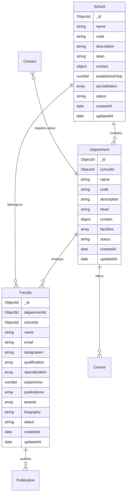

# Design

## 6.1 System Architecture

### 6.1.1 Overall Architecture Design

The College Website Management System follows a **Three-Tier Architecture** pattern with clear separation of concerns:

```
┌─────────────────────────────────────────┐
│           PRESENTATION TIER             │
│  ┌─────────────────┐ ┌─────────────────┐│
│  │   Public Web    │ │  Admin Panel    ││
│  │   (React.js)    │ │   (React.js)    ││
│  └─────────────────┘ └─────────────────┘│
└─────────────────────────────────────────┘
                    │
                    │ HTTP/HTTPS
                    │ REST API Calls
                    ▼
┌─────────────────────────────────────────┐
│            APPLICATION TIER             │
│  ┌─────────────────────────────────────┐ │
│  │        Express.js Server            │ │
│  │                                     │ │
│  │  ┌─────────┐ ┌─────────┐ ┌────────┐ │ │
│  │  │ Routes  │ │Contrllrs│ │Middlewr│ │ │
│  │  └─────────┘ └─────────┘ └────────┘ │ │
│  └─────────────────────────────────────┘ │
└─────────────────────────────────────────┘
                    │
                    │ Mongoose ODM
                    │ Database Queries
                    ▼
┌─────────────────────────────────────────┐
│              DATA TIER                  │
│  ┌─────────────────────────────────────┐ │
│  │           MongoDB Database          │ │
│  │                                     │ │
│  │ ┌─────┐ ┌─────┐ ┌─────┐ ┌─────────┐ │ │
│  │ │Schos│ │Depts│ │Facty│ │Contacts │ │ │
│  │ └─────┘ └─────┘ └─────┘ └─────────┘ │ │
│  └─────────────────────────────────────┘ │
└─────────────────────────────────────────┘
```

### 6.1.2 Technology Stack Architecture

**Backend Stack:**
- **Runtime:** Node.js (v18+)
- **Framework:** Express.js (v4.18+)
- **Database:** MongoDB (v6.0+)
- **ODM:** Mongoose (v7.0+)
- **Language:** TypeScript (v5.0+)

**Frontend Stack:**
- **Library:** React.js (v18+)
- **Language:** TypeScript (v5.0+)
- **Build Tool:** Vite (v4.0+)
- **Routing:** React Router (v6+)

## 6.2 Database Design

### 6.2.1 Entity Relationship Design



### 6.2.2 MongoDB Collection Schemas

**Schools Collection:**
```javascript
const schoolSchema = {
  name: { type: String, required: true, maxlength: 200 },
  code: { type: String, required: true, unique: true, maxlength: 10 },
  description: { type: String, required: true, maxlength: 2000 },
  dean: { type: String, required: true, maxlength: 100 },
  contact: {
    email: { type: String, required: true },
    phone: { type: String, required: true },
    office: { type: String, required: true }
  },
  establishedYear: { type: Number, required: true },
  accreditation: [{ type: String }],
  image: { type: String },
  status: { type: String, enum: ['active', 'inactive'], default: 'active' },
  createdAt: { type: Date, default: Date.now },
  updatedAt: { type: Date, default: Date.now }
};
```

**Departments Collection:**
```javascript
const departmentSchema = {
  schoolId: { type: Schema.Types.ObjectId, ref: 'School', required: true },
  name: { type: String, required: true, maxlength: 200 },
  code: { type: String, required: true, maxlength: 10 },
  description: { type: String, required: true, maxlength: 2000 },
  head: { type: String, required: true, maxlength: 100 },
  contact: {
    email: { type: String, required: true },
    phone: { type: String, required: true },
    office: { type: String, required: true }
  },
  faculty: [{ type: Schema.Types.ObjectId, ref: 'Faculty' }],
  facilities: [{ type: String }],
  achievements: [{ type: String }],
  image: { type: String },
  status: { type: String, enum: ['active', 'inactive'], default: 'active' }
};
```

**Faculty Collection:**
```javascript
const facultySchema = {
  departmentId: { type: Schema.Types.ObjectId, ref: 'Department', required: true },
  schoolId: { type: Schema.Types.ObjectId, ref: 'School', required: true },
  name: { type: String, required: true, maxlength: 100 },
  email: { type: String, required: true, unique: true },
  designation: { type: String, required: true },
  qualification: [{ type: String, required: true }],
  specialization: [{ type: String }],
  experience: { type: Number, required: true, min: 0 },
  researchInterests: [{ type: String }],
  publications: [{
    title: String,
    journal: String,
    year: Number,
    type: String,
    url: String
  }],
  awards: [{ type: String }],
  biography: { type: String, maxlength: 5000 },
  image: { type: String },
  cv: { type: String },
  phone: { type: String },
  office: { type: String },
  status: { type: String, enum: ['active', 'inactive'], default: 'active' }
};
```

### 6.2.3 Indexing Strategy

**Primary Indexes:**
- `_id` indexes (automatic)
- `email` unique index on Faculty collection
- `code` unique index on Schools collection

**Secondary Indexes:**
```javascript
// Faculty collection indexes
db.faculty.createIndex({ "departmentId": 1 });
db.faculty.createIndex({ "schoolId": 1 });
db.faculty.createIndex({ "name": "text", "designation": "text" });
db.faculty.createIndex({ "status": 1 });

// Department collection indexes
db.departments.createIndex({ "schoolId": 1 });
db.departments.createIndex({ "status": 1 });

// Contact collection indexes
db.contacts.createIndex({ "createdAt": -1 });
db.contacts.createIndex({ "status": 1 });
```

## 6.3 API Design

### 6.3.1 RESTful API Architecture

The API follows REST principles with clear resource-based URLs:

```
BASE_URL: http://localhost:5000/api

Public Endpoints:
├── GET    /schools                    # Get all schools
├── GET    /schools/:id                # Get school by ID
├── GET    /departments                # Get all departments
├── GET    /departments/:id            # Get department by ID
├── GET    /departments/school/:id     # Get departments by school
├── GET    /faculty                    # Get all faculty (public view)
├── GET    /faculty/:id                # Get faculty by ID
├── POST   /contacts                   # Submit contact inquiry

Admin Endpoints (Protected):
├── POST   /auth/login                 # Admin authentication
├── GET    /auth/verify                # Verify token
├── POST   /schools                    # Create school
├── PUT    /schools/:id                # Update school
├── DELETE /schools/:id                # Delete school
├── POST   /departments                # Create department
├── PUT    /departments/:id            # Update department
├── DELETE /departments/:id            # Delete department
├── POST   /faculty                    # Create faculty
├── PUT    /faculty/:id                # Update faculty
├── DELETE /faculty/:id                # Delete faculty
├── GET    /contacts                   # Get all contacts
├── PUT    /contacts/:id               # Update contact status
└── DELETE /contacts/:id               # Delete contact
```

### 6.3.2 Request/Response Design

**Standard Response Format:**
```javascript
{
  "success": boolean,
  "message": string,
  "data": object|array,
  "error": string|null,
  "pagination": {
    "page": number,
    "limit": number,
    "total": number,
    "totalPages": number
  }
}
```

**Error Response Format:**
```javascript
{
  "success": false,
  "message": "Error description",
  "error": "Detailed error message",
  "code": "ERROR_CODE",
  "statusCode": number
}
```

### 6.3.3 Authentication Design

**JWT Token Structure:**
```javascript
{
  "header": {
    "alg": "HS256",
    "typ": "JWT"
  },
  "payload": {
    "userId": "ObjectId",
    "email": "admin@college.edu",
    "role": "admin",
    "iat": 1234567890,
    "exp": 1234567890
  }
}
```

## 6.4 Frontend Design

### 6.4.1 Component Architecture

```
src/
├── components/
│   ├── shared/               # Reusable components
│   │   ├── Button/
│   │   ├── LoadingSpinner/
│   │   ├── ErrorMessage/
│   │   └── Modal/
│   ├── college/              # Public website components
│   │   ├── Header/
│   │   ├── Footer/
│   │   ├── Navigation/
│   │   └── ContactForm/
│   └── admin/                # Admin panel components
│       ├── AdminHeader/
│       ├── AdminSidebar/
│       ├── FacultyForm/
│       └── ContactManager/
├── pages/
│   ├── college/              # Public pages
│   │   ├── Home/
│   │   ├── About/
│   │   ├── Faculty/
│   │   └── Contact/
│   └── admin/                # Admin pages
│       ├── Dashboard/
│       ├── ManageFaculty/
│       └── ManageContacts/
├── hooks/                    # Custom React hooks
│   ├── useFacultyData/
│   ├── useContactForm/
│   └── useAuth/
├── services/                 # API service functions
│   ├── facultyApi.ts
│   ├── contactApi.ts
│   └── authApi.ts
└── types/                    # TypeScript definitions
    ├── faculty.types.ts
    ├── contact.types.ts
    └── api.types.ts
```

### 6.4.2 State Management Design

**Local State Management:**
- Component-level state using `useState` hook
- Form state management with custom hooks
- Loading and error states for API calls

**Shared State Management:**
- Custom hooks for data fetching and caching
- Context API for authentication state
- Local storage for user preferences

### 6.4.3 Responsive Design Strategy

**Breakpoint System:**
```css
/* Mobile First Approach */
:root {
  --mobile: 320px;
  --tablet: 768px;
  --desktop: 1024px;
  --large-desktop: 1440px;
}

/* Responsive Grid System */
.grid {
  display: grid;
  gap: 1rem;
  grid-template-columns: 1fr;
}

@media (min-width: 768px) {
  .grid {
    grid-template-columns: repeat(2, 1fr);
  }
}

@media (min-width: 1024px) {
  .grid {
    grid-template-columns: repeat(3, 1fr);
  }
}
```

## 6.5 Security Design

### 6.5.1 Authentication & Authorization

**Password Security:**
- bcrypt hashing with salt rounds (12)
- Password complexity requirements
- Secure password reset mechanism

**JWT Implementation:**
- Short-lived access tokens (15 minutes)
- Refresh token rotation
- Secure token storage

**Authorization Levels:**
```javascript
const permissions = {
  public: ['read:public-content'],
  admin: [
    'read:all-content',
    'write:content',
    'manage:faculty',
    'manage:contacts',
    'manage:events'
  ]
};
```

### 6.5.2 Data Protection

**Input Validation:**
- Schema-level validation (Mongoose)
- Request validation (express-validator)
- XSS protection (sanitization)
- SQL injection prevention (parameterized queries)

**Security Headers:**
```javascript
app.use(helmet({
  contentSecurityPolicy: {
    directives: {
      defaultSrc: ["'self'"],
      styleSrc: ["'self'", "'unsafe-inline'"],
      scriptSrc: ["'self'"],
      imgSrc: ["'self'", "data:", "https:"]
    }
  },
  hsts: {
    maxAge: 31536000,
    includeSubDomains: true,
    preload: true
  }
}));
```

## 6.6 Performance Design

### 6.6.1 Database Optimization

**Query Optimization:**
- Proper indexing strategy
- Aggregation pipeline usage
- Population optimization
- Query result limiting

**Caching Strategy:**
- In-memory caching for frequently accessed data
- Browser caching for static assets
- API response caching

### 6.6.2 Frontend Optimization

**Code Splitting:**
```javascript
// Lazy loading for admin components
const ManageFaculty = lazy(() => import('./pages/admin/ManageFaculty'));
const ManageContacts = lazy(() => import('./pages/admin/ManageContacts'));
```

**Asset Optimization:**
- Image compression and optimization
- CSS minification and bundling
- JavaScript tree shaking
- Gzip compression

This comprehensive design ensures scalable, secure, and maintainable system architecture while focusing on backend best practices and modern web development standards.
